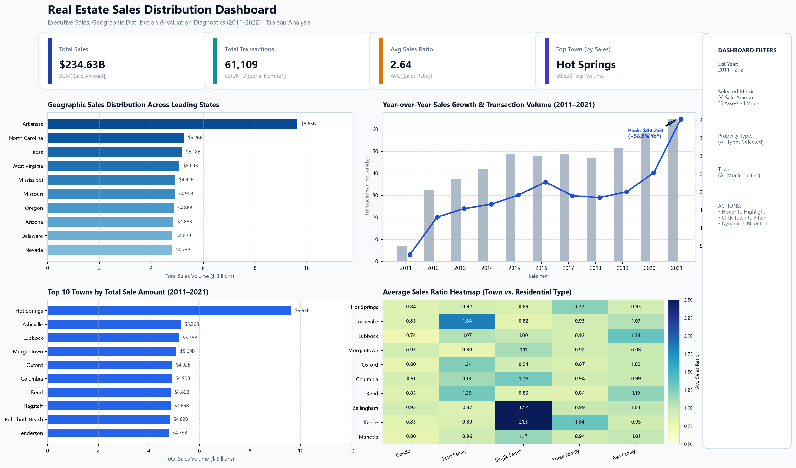
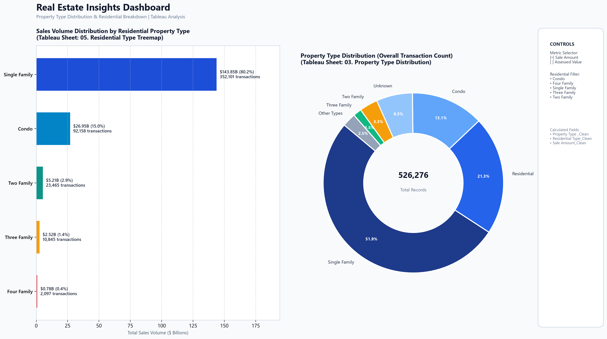
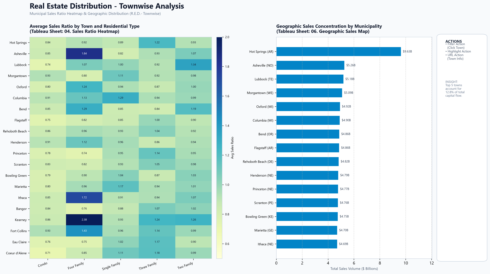
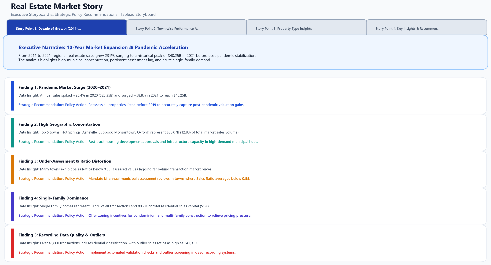

# Real Estate Sales Analysis | Tableau

An interactive Tableau analytics project evaluating property sales, municipal transaction volume, and sale-to-assessed value ratios across 526,276 recorded transactions from 2011 to 2022. The project was built around a municipal planning scenario to analyze market growth patterns, town-level sales concentration, residential property mix, and assessment disparities.

The accompanying Tableau workbook features interactive dashboards with parameter-driven metric switching, cross-filtering, dual-axis trend analysis, valuation heatmaps, and a guided 4-part storyboard.

---

## Project Overview

- **Dataset Scale:** 526,276 property sales records across 14 attributes.
- **Timeframe:** 2011–2021 list years with recorded transaction dates spanning through 2022.
- **Geographic Scope:** Multi-municipal regional property sales data with town- and state-level geographic identifiers based on standardized municipal assessment reporting.
- **Core Focus:** Tracking 11-year sales trajectory, identifying top municipal revenue drivers, analyzing residential type distributions, and diagnosing municipal assessment lag via sales ratios.
- **Context:** Prepared for municipal zoning and planning boards to support data-informed property tax reassessment schedules, residential zoning revisions, and local housing supply strategies.

---

## Key Questions Explored

1. **Macro Growth Trajectory:** How did total real estate sales and transaction volume shift between 2011 and 2022, particularly through the 2020–2021 pandemic period?
2. **Municipal Revenue Leaders:** Which towns generated the largest share of overall capital volume, and how concentrated is market activity?
3. **Property Composition:** How are sales distributed across property classifications (Single Family, Condos, Commercial, Multi-Family), and which residential segment dominates dollar volume?
4. **Assessment vs. Market Discrepancies:** How do final transaction prices compare to municipal assessed valuations across towns, and where are assessment lag risks highest?
5. **Data Integrity:** What recording anomalies or missing data exist in the transaction registry, and how do they impact valuation analysis?

---

## Snapshot

| Metric | Value | Definition / Calculation |
|:---|---:|:---|
| **Total Sales Volume** | **$234.63B** | `SUM([Sale Amount])` across all recorded transactions |
| **Total Transactions** | **61,109** | `COUNTD([Serial Number])` unique transaction IDs (526,276 total records) |
| **Average Sales Ratio** | **2.64** | `AVG([Sales Ratio])` (Median: 0.67; heavily skewed by recording outliers) |
| **Top Municipality** | **Hot Springs** | **$9.63B** in cumulative sales volume (4.10% of total regional market) |
| **Peak Recorded Year** | **2021** | **$40.25B** recorded in a single year (+58.8% YoY surge) |
| **Primary Property Segment** | **Single Family** | **51.9%** of transaction volume / **80.2%** of residential sales ($143.85B) |

*Note: Dollar amounts are rounded to two decimal places. The average sales ratio is influenced by outlier transactions discussed in the findings below.*

---

## Dashboards

### 1. Real Estate Sales Distribution Dashboard

The primary executive dashboard brings together high-level KPI cards, geographic sales distribution, dual-axis historical trends, town rankings, and an assessment ratio heatmap into a single interactive view.



- **Top Row:** 4 headline KPI cards summarizing total capital volume ($234.63B), transaction volume (61,109 unique sales), average ratio (2.64), and the leading municipality (Hot Springs).
- **Middle Section:** State-level sales distribution paired with an 11-year dual-axis chart showing annual sales dollars plotted against transaction volume.
- **Bottom Section:** Top 10 towns by cumulative sales alongside a town-by-residential-type sales ratio heatmap.

---

### 2. Real Estate Insights Dashboard

A dedicated property composition dashboard that breaks down transaction volume across primary property types and details sales distribution within residential sub-categories.



- **Residential Volume Treemap (Left):** Visualizes the $179.31B residential market, demonstrating Single Family dominance ($143.85B / 80.2%) followed by Condominiums ($26.95B / 15.0%) and Multi-Family segments.
- **Property Type Distribution (Right):** A donut chart categorizing all 526,276 records into Single Family, Residential, Condos, Commercial, Multi-Family, Vacant Land, and unclassified entries.

---

### 3. Townwise Analysis (R.E.D.- Townwise)

Designed for municipal assessors and zoning officials to examine local tax assessment equity and geographic sales concentration side by side.



- **Sales Ratio Heatmap (Left):** Cross-tabulates 20 major municipalities against the 5 residential property types, highlighting healthy assessment bands (0.70–1.20) and flagging towns where ratios diverge significantly.
- **Geographic Sales Concentration (Right):** Ranks top municipalities by total transaction capital, providing context on where transaction density is concentrated.

---

### 4. Real Estate Market Story

A structured 4-slide Tableau Story designed to present findings and strategic policy recommendations directly to municipal decision-makers.



- **Slide 1:** *The Decade of Growth (2011–2021)* — Explores the 231% 10-year market expansion.
- **Slide 2:** *Town-wise Performance Analysis* — Evaluates top municipal markets and capital concentration.
- **Slide 3:** *Property Type Insights* — Breaks down property mix and housing supply constraints.
- **Slide 4:** *Key Insights & Strategic Recommendations* — Translates data patterns into actionable municipal policy guidance.

---

## Key Findings

All figures below are calculated directly from the project dataset and verified against the Tableau workbook calculations:

- **10-Year Market Expansion (+231%):** Recorded sales rose from $2.60B in 2011 (7,122 sales) to a peak of $40.25B in 2021 (64,441 sales). Sales grew steadily through 2016 ($22.75B), leveled off between 2017 and 2019 ($18.95B to $20.05B), and then accelerated rapidly during the pandemic.
- **Pandemic Surge (2020–2021):** Annual sales jumped 26.4% in 2020 ($25.35B) and surged another 58.8% in 2021 ($40.25B). Total recorded transactions peaked simultaneously in 2021 at 64,441 records before moderating in 2022 ($22.11B across 40,946 records).
- **Top Municipal Revenue Drivers:** Hot Springs generated the highest total sales volume at **$9.63B** (4.10% of total regional sales). The remaining top 5 municipalities were Asheville ($5.26B), Lubbock ($5.18B), Morgantown ($5.09B), and Oxford ($4.92B).
- **Geographic Capital Concentration:** The top 5 towns accounted for **$30.07B**, or **12.82%** of all market sales volume. The top 10 towns together generated **$54.29B** (23.14% of total market volume), reflecting substantial geographic concentration of real estate capital.
- **Single Family Dominance:** Single Family properties represent **51.90%** of all transaction records (273,147 sales) and account for **80.23%** ($143.85B) of all residential sales volume. Condominiums represent **15.03%** ($26.95B across 92,158 sales), while two-, three-, and four-family homes represent a combined 4.74% of residential sales.
- **Assessment Disparities & Ratio Outliers:** The dataset median sales ratio is **0.6690**, consistent with properties trading above municipal assessed values. However, extreme recording errors (ratios up to 241,910) pull the mathematical average to **2.6380**. Furthermore, multiple towns exhibit average sales ratios below 0.55, indicating that local property tax assessments have lagged substantially behind market price appreciation.
- **Registry Data Hygiene:** Out of 526,276 records, 45,610 entries (8.67%) lack residential type tags, and 34,172 entries (6.49%) have null property type values. Implementing validation rules at transaction recording intake is essential for reliable assessment analytics.

---

## Tools Used

- **Tableau Desktop / Tableau Public 2026.2:** Dashboard authoring, dual-axis charts, treemaps, heatmaps, parameter controls, action filters, and storyboard design.
- **Microsoft Excel (.xlsx):** Source transaction dataset storage and schema inspection.
- **Calculated Fields:**
  - `Sale Year`: `YEAR([Date Recorded])`
  - `Sale Amount_Clean`: `IF [Parameters].[Parameter 1] = "Sale Amount" THEN [Sale Amount] ELSE [Assessed Value] END`
  - `Property Type _Clean`: `IF ISNULL([Property Type]) THEN "Unknown" ELSE [Property Type] END`
  - `Residential Type_Clean`: `IF ISNULL([Residential Type]) THEN "UNKNOWN" ELSE [Residential Type] END`
  - `Sales Category`: `IF [Sale Amount] >= 1000000 THEN "High" ELSEIF [Sale Amount] >= 300000 THEN "Medium" ELSE "Low" END`
- **Tableau Parameters:** `[Parameter 1]` (`Selected Metric Value`) to toggle between *Sale Amount* and *Assessed Value*.
- **Git & GitHub:** Version control, portfolio documentation, and asset management.

---

## Analysis Workflow

```
┌─────────────────────────────────┐
│     1. Data Connection & Audit  │  Connected 526K+ row Excel file; verified field types, date ranges, and nulls.
└────────────────┬────────────────┘
                 │
┌────────────────▼────────────────┐
│  2. Data Cleaning & Calculations│  Derived Sale Year, built null-safe dimensions, and categorized price tiers.
└────────────────┬────────────────┘
                 │
┌────────────────▼────────────────┐
│  3. Parameter-Driven Metrics    │  Built dynamic parameter switcher toggling between Sale Amount & Assessed Value.
└────────────────┬────────────────┘
                 │
┌────────────────▼────────────────┐
│  4. Worksheet Development       │  Constructed 11 dedicated analysis sheets (KPIs, dual-axis trends, heatmaps).
└────────────────┬────────────────┘
                 │
┌────────────────▼────────────────┐
│  5. Dashboard Architecture      │  Combined sheets into 3 specialized dashboards with synchronized filters.
└────────────────┬────────────────┘
                 │
┌────────────────▼────────────────┐
│  6. Interactive Actions         │  Added cross-filter actions, highlight actions, and town-level URL actions.
└────────────────┬────────────────┘
                 │
┌────────────────▼────────────────┐
│  7. Executive Storytelling      │  Synthesized findings into a 4-part Tableau Story with policy recommendations.
└─────────────────────────────────┘
```

---

## Dashboard Features

- **Dynamic Metric Switcher:** A parameter dropdown allows stakeholders to toggle visualizations between actual transaction prices (`Sale Amount`) and municipal valuations (`Assessed Value`) without changing worksheets.
- **Multi-Level Filtering:** Global dashboard filters for List Year (2011–2021), Property Type, and Town with apply-to-all-worksheets scoping.
- **Synchronized Dual-Axis Trends:** Integrates bar marks for transaction volume and line marks for total dollar volume on a shared time axis.
- **Outlier-Aware Valuation Heatmap:** Color-coded matrix identifying municipal assessment anomalies and ratio compression across residential subtypes.
- **Interactive URL Actions:** Clicking a municipality passes the town name parameter to open municipal reference or local market profiles.
- **Story Point Walkthrough:** Four structured narrative slides enabling executive presentation without needing to manually configure dashboard filters during a briefing.

---

## Repository Structure

```
real-estate-sales-analysis-tableau/
│
├── README.md                                  # Complete project documentation & analysis report
├── .gitignore                                 # Git ignore rules for scratch files and caches
│
├── Tableau/
│   └── real_estate_sales.twbx                 # Packaged Tableau workbook with embedded extract
│
├── Data/
│   └── Real_Estate_Sales_2011-2022_GL_1 (1).xlsx   # Source real estate sales dataset (526K rows)
│
├── Dashboard/
│   ├── real_estate_sales_distribution.png     # Primary executive dashboard screenshot
│   ├── real_estate_insights_dashboard.png     # Property type & residential breakdown screenshot
│   ├── townwise_analysis.png                  # Municipal heatmap & geographic analysis screenshot
│   └── market_story.png                       # 4-part executive storyboard screenshot
│
├── docs/
│   └── assignment_brief.pdf                   # Municipal planning board project brief & requirements
│
└── assets/
    └── tableau_native_previews/               # 15 native thumbnail previews extracted from workbook XML
```

---

## How to View

1. **Clone the repository:**
   ```bash
   git clone https://github.com/akshatraghav22/real-estate-sales-analysis-tableau.git
   ```
2. **Open the Tableau Workbook:**
   - Launch [Tableau Desktop](https://www.tableau.com/products/desktop) or the free [Tableau Public](https://www.tableau.com/products/public) application.
   - Open `Tableau/real_estate_sales.twbx`.
3. **Explore Dashboards & Story:**
   - Use the bottom navigation tabs to switch between the 3 dashboards and the `Real Estate Market Story`.
   - Test the `Selected Metric Value` parameter control on the right sidebar to compare market sales vs. municipal assessed values.
   - Filter by specific years or towns to evaluate local micro-markets.

---

## Strategic Recommendations for Planning Boards

Based on the empirical findings from this 11-year analysis, three immediate policy initiatives are recommended:

1. **Implement Targeted Reassessment Cycles:** Because regional sales surged +58.8% in 2021 while median sales ratios sit well below 0.70 in several towns, municipal assessed values lag current market conditions significantly. Prioritize reassessment for properties listed before 2019 to prevent municipal revenue erosion and maintain property tax equity.
2. **Incentivize Diverse Residential Supply:** Single-family homes represent 80.2% of residential dollar volume, driving upward price pressure during high-demand cycles. Providing zoning incentives for condominium and multi-family development will expand starter-home inventory and balance local housing stock.
3. **Establish Registry Validation Rules:** Implement automated validation thresholds at the deed recording intake stage to eliminate null classifications and flag ratio anomalies (>10.0 or <=0.0) before records enter municipal assessment databases.
